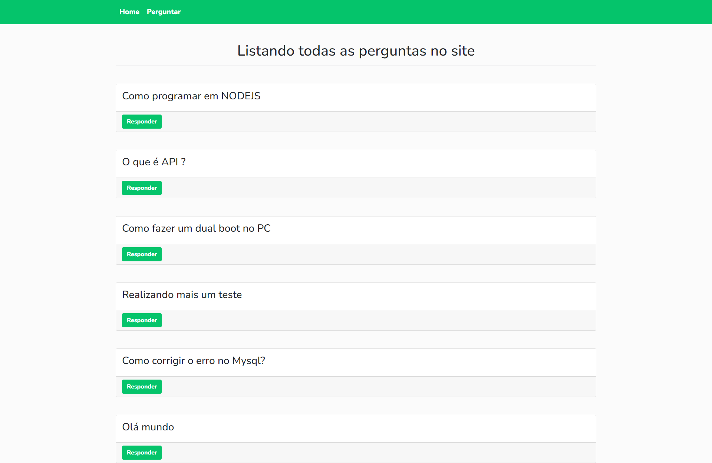
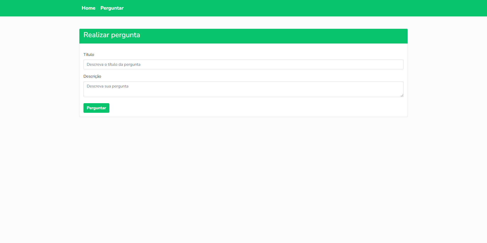
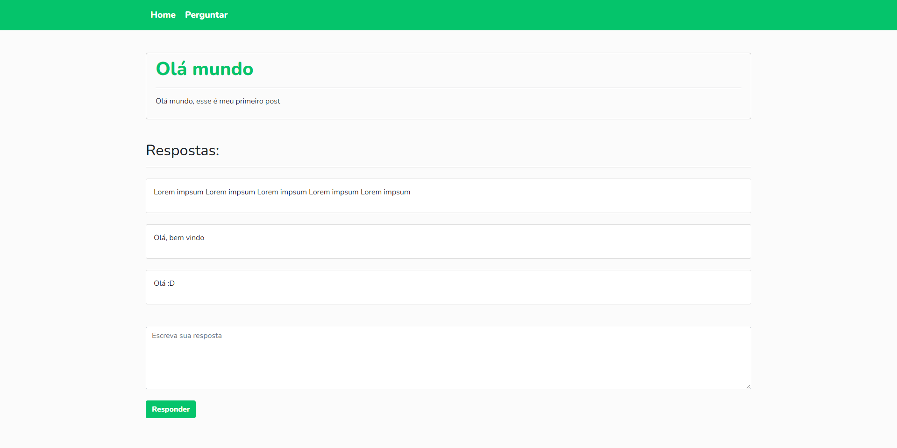

 

    
    
    

  <h3 align="center">Guia de Perguntas</h3>
  
  

    Projeto para estudos feito em NODEJS     

  

## Índice

- [Update](#update) - Ainda por fazer
- [Techs](#techs)
- [Cores](#cores)
- [Modelo](#modelo)
- [Tipo de fonte](#tipo-de-fonte)

# Update: (Ainda por fazer)

- Finalização da responsividade
- Adição de novos recursos no template
- Páginas secundárias 
- Colocar data em que a foi realizada a pergunta
- integração de usuario com login e identificação das perguntas por os mesmos
- avaliação das respostas por outros usuarios

# Techs:

- HTML
- CSS
- JS
- NODEJS
- BOOTSTRAP
- MYSQL

## Cores:

    --color-verde: #05c46b;
    --color-branco: #ffffff;

## Modelo:

O modelo da landing page foi desenvolvido por <a href="https://www.linkedin.com/in/lucasalexsandro/">Lucas Alexsandro</a> Com base em estudos no curso de NODEJS 

## Tipo de fonte:

  font-family: 'Nunito', sans-serif;
